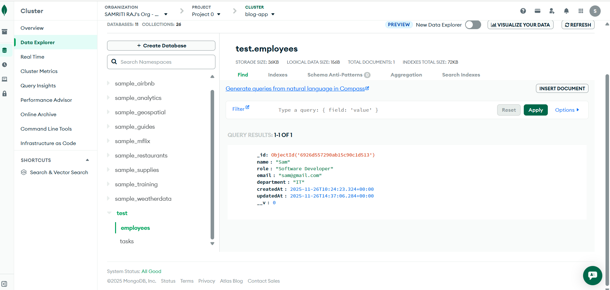

# TASKFLOW MANAGER

TaskFlow Manager is a small full-stack project built for the Track 3 assignment.
The goal was to create a complete system where we can:

Manage employees

Create and assign tasks

Edit or delete records

View overall stats on a dashboard

This project includes both the frontend (React) and backend (Node.js + MongoDB), fully connected.

APP Demo :
https://github.com/user-attachments/assets/ddf3eaa4-f21a-4554-afb3-4dd2b64dc406

# Tech Stack
Frontend

React (Vite)

Tailwind CSS

Axios

React Router

Lucide Icons

Backend

Node.js + Express

MongoDB + Mongoose

dotenv

CORS

Database

MongoDB (Local or Atlas)

# Project Structure
Track3/

    backend/ = API + Database
    
    frontend/ = UI built with React + Tailwind
    
    README.md

# Features
Dashboard

Shows total employees, tasks, pending tasks, completed tasks

Highlights recent tasks and team members

Employees

Add employee

View all employees

Search by name/role/department

Edit / Delete employees

Tasks

Add new task

Assign it to any employee

Edit / Delete tasks

Status tracking (Pending / Completed)

Backend API

Full CRUD for both employees and tasks

Connected to MongoDB

Clean REST endpoints

# Backend Setup
cd backend

npm install

Create a .env file:

PORT=5000

Start the backend:
npm start

# Frontend Setup
cd frontend

npm install

npm run dev

App will run at:

Frontend : http://localhost:5173
Backend  : http://localhost:5000

# Screenshots

# Deployment

Frontend: Vercel 

Backend: Render 

Database: MongoDB Atlas

# Extra Work Done

Reusable UI components

Fully responsive design

Clean folder structure

Error handling for forms

Interface kept simple and easy to use
